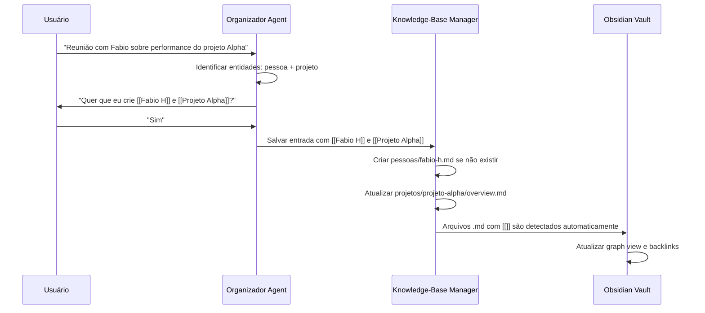
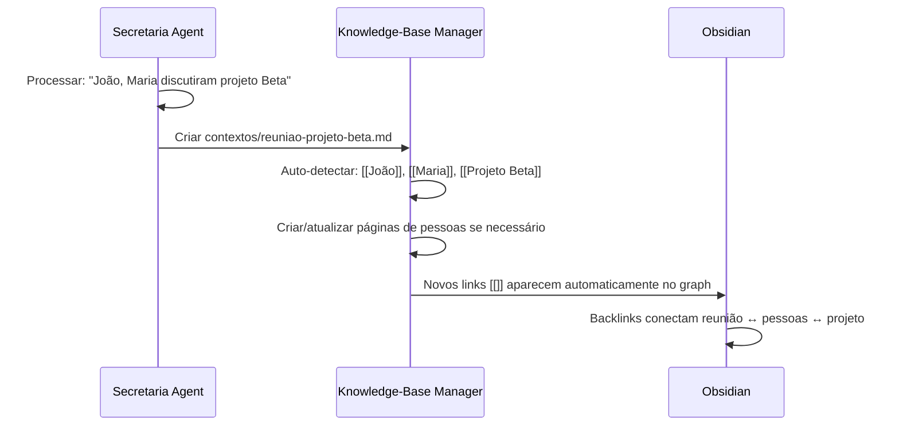

# Assistente Pessoal IA - Documento de Arquitetura Backend

## Introdução

Esta arquitetura define o sistema backend para o **Assistente Pessoal IA** - uma evolução do BMAD method para criar um "segundo cérebro" pessoal especializado para usuários com TDAH. O sistema mantém a simplicidade e eficácia do BMAD atual, mas adiciona inteligência para captura ultra-rápida, organização automática, e múltiplos agentes especializados.

### Starter Template ou Projeto Existente

**Projeto Base:** Conceitos BMAD + Estrutura `.assistant-core/` Especializada

**Estrutura Definitiva:**
```
assistente-pessoal-ia/
├── .assistant-core/             # Core do assistente pessoal
│   ├── agents/                  # Configurações dos 5 agentes especializados
│   │   ├── organizador.yaml
│   │   ├── secretaria.yaml
│   │   ├── arquiteto.yaml
│   │   ├── psicologo.yaml      # Fase 2
│   │   └── mentor.yaml         # Fase 2
│   ├── templates/               # Templates para diferentes tipos de documento
│   ├── tasks/                   # Workflows de automação inteligente
│   ├── data/                    # Configurações e métodos de elicitação
│   └── core-config.yaml         # Configuração central do sistema
├── despejo/
│   └── daily-dump.txt          # Captura ultra-rápida sem estrutura
├── knowledge-base/             # "Segundo cérebro" compartilhado
│   ├── decisoes/
│   ├── contextos/
│   ├── projetos/
│   └── pessoas/
├── todos/
│   └── central-todos.md
└── diario/                     # Diários estruturados por data
    ├── 2025-01-09-diario.md
    └── ...
```

**Vantagens da Estrutura `.assistant-core/`:**
- Nome claro e profissional que reflete o propósito
- Mantém padrões comprovados do BMAD (slash commands, YAML, workflows)
- Adiciona inteligência específica para TDAH e "segundo cérebro"
- Permite evolução independente sem limitações de framework externo

### Log de Mudanças

| Data | Versão | Descrição | Autor |
|------|---------|-----------|-------|
| 2025-01-09 | 1.0 | Arquitetura inicial baseada em evolução do BMAD | Winston (Architect) |

## Arquitetura de Alto Nível

### Resumo Técnico

O sistema implementa uma **arquitetura conversacional baseada em agentes** que evolui os conceitos BMAD para criar um "segundo cérebro" especializado para TDAH. Cinco agentes especializados (`/organizador`, `/secretaria`, `/arquiteto`, `/psicologo`, `/mentor`) compartilham uma knowledge-base inteligente local, otimizando para captura ultra-rápida (<5 segundos) e recuperação contextual (<3 segundos). O sistema prioriza transparência total (arquivos .md human-readable), zero fricção (sem formulários), e personalidades confrontadoras que aceleram crescimento pessoal/profissional.

### Visão Geral de Alto Nível

**Estilo Arquitetural:** Arquitetura conversacional orientada a agentes com knowledge-base compartilhada
- **Estrutura de Repositório:** Monorepo (decisão PRD) com todos os componentes em um repositório único
- **Arquitetura de Serviços:** Sistema local baseado em arquivos com agentes especializados via Claude Code
- **Fluxo Principal:** Usuário → Slash Command → Agente Especializado → Knowledge-base → Resposta Contextualizada

**Decisões Arquiteturais Críticas:**
1. **Local-First:** Zero dependências externas exceto Claude Code (privacidade TDAH)
2. **File-Based:** Arquivos .md/.yaml como persistência (transparência + versionamento Git)
3. **Agent-Oriented:** Cinco agentes especializados com personalidades distintas
4. **Conversation-Driven:** Interface exclusivamente conversacional (zero UI tradicional)
5. **Intelligence-Enhanced:** IA gerencia organização automática e splitting de arquivos

### Diagrama de Projeto de Alto Nível

```mermaid
graph TD
    User[Usuário TDAH] --> Claude[Claude Code Interface]

    Claude --> Org[/organizador]
    Claude --> Sec[/secretaria]
    Claude --> Arq[/arquiteto]
    Claude --> Psi[/psicologo - Fase 2]
    Claude --> Men[/mentor - Fase 2]

    Dump[daily-dump.txt] --> Org

    Org --> KB[Knowledge-Base Inteligente]
    Sec --> KB
    Arq --> KB
    Psi --> KB
    Men --> KB

    KB --> Dec[decisoes/*.md]
    KB --> Ctx[contextos/*.md]
    KB --> Proj[projetos/*.md]
    KB --> Ppl[pessoas/*.md]

    KB --> Split[IA Auto-Split Arquivos]
    KB --> Cross[Referências [[]] Obsidian]

    Sec --> Todos[central-todos.md]
    Sec --> Diary[diario/*.md]

    subgraph "Sistema Local"
        Claude
        KB
        Split
        Cross
    end

    subgraph "Agentes MVP"
        Org
        Sec
        Arq
    end

    subgraph "Agentes Fase 2"
        Psi
        Men
    end
```

### Padrões Arquiteturais e de Design

- **Padrão de Agente Especializado:** Cada agente tem personalidade, funcionalidades e contexto específicos - _Rationale:_ Espelha como cérebro humano tem diferentes áreas especializadas, otimiza para diferentes tipos de consultoria
- **Knowledge-Base Compartilhada:** Base única com acesso cruzado automático entre agentes - _Rationale:_ Elimina silos de informação, permite contexto holístico, simula memória associativa
- **Captura Ultra-Rápida:** Arquivo despejo sem estrutura obrigatória → organização IA posterior - _Rationale:_ Remove fricção crítica para usuários TDAH, permite captura no momento do insight
- **Confronto Construtivo:** Agentes questionam ao invés de validar automaticamente - _Rationale:_ Acelera crescimento pessoal/profissional, evita confirmação bias, simula mentoria real
- **File-Based Persistence:** Arquivos .md como "banco de dados" - _Rationale:_ Transparência total, versionamento Git, portabilidade, eliminação de lock-in de tecnologia
- **Referências [[]] Obsidian:** Sistema de links Wiki-style para conectar informações - _Rationale:_ Cria rede de conhecimento conectada, aproveita poder do Obsidian para visualização

## Tech Stack

### Infraestrutura em Nuvem

- **Provedor:** N/A (Sistema 100% Local)
- **Serviços Principais:** Sistema de arquivos local + Claude Code + Obsidian
- **Regiões de Deploy:** Máquina local do usuário

### Tabela de Stack Tecnológico

| Categoria | Tecnologia | Versão | Propósito | Rationale |
|-----------|------------|---------|-----------|-----------|
| **Plataforma** | Claude Code | Current | Interface principal e processamento IA | Subscription existente, elimina complexidade adicional |
| **Configuração** | YAML | 1.2 | Templates e configuração de agentes | Human-readable, compatível com BMAD patterns |
| **Documentos** | Markdown | CommonMark | Knowledge-base e persistência | Transparente, versionável, universalmente suportado |
| **Referências** | Obsidian | Current | Gerenciamento automático de [[links]] | Graph view, backlinks automáticos, mobile access |
| **Versionamento** | Git | 2.40+ | Backup e histórico de mudanças | Robusto, permite rollback, familiar para desenvolvedor |
| **Estrutura** | Filesystem | N/A | Organização de dados | Zero overhead, máxima simplicidade |
| **Processamento** | Claude API | Current | IA para organização e splitting | Integrado ao Claude Code, sem APIs adicionais |

## Modelos de Dados

### Daily Dump

**Propósito:** Captura ultra-rápida de informações sem estrutura obrigatória - o ponto de entrada para todo o sistema.

**Estrutura do Arquivo:** `despejo/daily-dump.txt`
```
Qualquer texto livre aqui...
Reunião com [[Fabio H]] sobre API performance do [[Projeto Alpha]]
Bug no sistema de login - investigar
Ideia: automatizar backup dos configs
Lembrar de call com [[Cliente XYZ]] às 15h
```

### Knowledge Entry

**Propósito:** Unidade básica de conhecimento organizado na knowledge-base compartilhada.

**Estrutura Padrão:**
```yaml
---
id: unique-identifier
type: decisao|contexto|projeto|pessoa
created: 2025-01-09T10:30:00
updated: 2025-01-09T15:45:00
source_agent: organizador|secretaria|arquiteto|psicologo|mentor
tags: [tag1, tag2, tag3]
project: [[Nome do Projeto]] (se aplicável)
related_people: [[[Pessoa 1]], [[Pessoa 2]]]
---

# Título da Entrada

Conteúdo em Markdown livre...

## Contexto
Discussão com [[Fabio H]] sobre performance do [[Projeto Alpha]].

## Decisões
- Implementar [[Cache Redis]] para queries frequentes
- [[Fabio H]] vai medir métricas baseline
```

### Project Context

**Propósito:** Agregação de todo contexto relacionado a um projeto específico.

**Estrutura:** `knowledge-base/projetos/[[Nome Projeto]]/overview.md`
```yaml
---
id: projeto-alpha
name: "[[Projeto Alpha]]"
status: ativo|pausado|concluido
priority: alta|media|baixa
created: 2025-01-09
team_members: [[[Fabio H]], [[Maria Santos]]]
key_decisions: [[[Decisão Arquitetura API]], [[Escolha Tech Stack]]]
---

# [[Projeto Alpha]]

## Visão Geral
Descrição do projeto...

## Equipe
- [[Fabio H]] - Tech Lead
- [[Maria Santos]] - Frontend Developer

## Status Atual
Última atualização automática pelo /secretaria...
```

## Componentes

### Organizador Agent

**Responsabilidade:** Processamento inteligente do arquivo despejo e categorização automática na knowledge-base.

**Interfaces Principais:**
- `processar_despejo()` - Analisa daily-dump.txt via perguntas específicas
- `categorizar_automaticamente()` - Salva informações na knowledge-base com metadados
- `criar_referencias()` - Gera links [[]] automaticamente para pessoas/projetos
- `organizar_por_projeto()` - Agrupa informações por contexto de projeto

**Dependências:** Knowledge-base, daily-dump.txt, Agent Memory System

**Stack Tecnológico:** Claude Code + YAML configs + Markdown templates

### Secretaria Agent

**Responsabilidade:** Gestão executiva completa com processamento de reuniões e extração automática de todos.

**Interfaces Principais:**
- `agenda_do_dia()` - Dashboard executivo de compromissos
- `status_projetos()` - Visão consolidada de todos projetos ativos
- `registro_reuniao()` - Transcrição → resumo estruturado + todos automáticos
- `extrair_referencias_pessoas()` - Identifica [[pessoas]] em contextos
- `whats_next()` - Sugestões inteligentes baseadas em contexto

**Dependências:** Knowledge-base, central-todos.md, diario/*.md, Agent Memory

**Stack Tecnológico:** Claude Code + templates de reunião + processamento de texto

### Arquiteto Agent

**Responsabilidade:** Consultoria técnica especializada com memória contextual profunda e confronto construtivo sobre decisões arquiteturais.

**Interfaces Principais:**
- `analise_projeto()` - Review técnico de URLs/repositórios
- `discussao_tecnica()` - Consultoria sobre padrões e decisões
- `contexto_decisoes()` - Recuperação de rationale histórico via [[referências]]
- `confronto_tecnico()` - Questionamento construtivo baseado em histórico
- `conectar_decisoes()` - Liga decisões técnicas relacionadas via [[]]

**Dependências:** Knowledge-base/decisoes/, Agent Memory, histórico técnico

**Stack Tecnológico:** Claude Code + templates técnicos + contexto arquitetural

### Knowledge-Base Manager

**Responsabilidade:** Sistema inteligente de gerenciamento da base compartilhada com referências [[]] e splitting automático.

**Interfaces Principais:**
- `salvar_entrada()` - Persiste nova informação com metadados automáticos
- `gerar_referencias_obsidian()` - Cria links [[]] para pessoas, projetos, conceitos
- `split_arquivo_grande()` - Divide arquivos >2000 linhas inteligentemente
- `manter_consistencia_links()` - Atualiza [[referências]] após mudanças

**Dependências:** Sistema de arquivos, Git, Obsidian vault

**Stack Tecnológico:** Claude Code + file system + YAML parsing + Obsidian integration

### Agent Memory System

**Responsabilidade:** Manutenção de memória contextual e personalidade consistente para cada agente especializado.

**Interfaces Principais:**
- `carregar_memoria_agente()` - Recupera contexto e personalidade específicos
- `atualizar_interacao()` - Registra nova interação e aprendizados
- `manter_personalidade()` - Garante consistência comportamental
- `identificar_padroes_referencias()` - Detecta padrões de uso de [[]]

**Dependências:** .assistant-core/memory/, histórico de interações

**Stack Tecnológico:** YAML configs + Claude Code + pattern recognition

## Workflows Centrais

### Workflow 1: Processamento de Despejo com Referências [[]]



### Workflow 2: Registro de Reunião com Links Automáticos



## Estrutura de Arquivos (Source Tree)

```
assistente-pessoal-ia/
├── .assistant-core/                 # Core do assistente pessoal
│   ├── agents/                      # Configurações dos agentes especializados
│   │   ├── organizador.yaml         # Config do /organizador (MVP)
│   │   ├── secretaria.yaml          # Config do /secretaria (MVP)
│   │   ├── arquiteto.yaml           # Config do /arquiteto (MVP)
│   │   ├── psicologo.yaml           # Config do /psicologo (Fase 2)
│   │   └── mentor.yaml              # Config do /mentor (Fase 2)
│   ├── templates/                   # Templates para documentos
│   │   ├── reuniao-resumo.yaml      # Template para registro de reuniões
│   │   ├── projeto-analise.yaml     # Template para análise de projetos
│   │   ├── pessoa-profile.yaml      # Template para páginas de pessoas
│   │   └── decisao-tecnica.yaml     # Template para decisões arquiteturais
│   ├── tasks/                       # Workflows de automação
│   │   ├── processar-despejo.md     # Workflow do organizador
│   │   ├── extrair-todos.md         # Workflow da secretaria
│   │   └── criar-referencias.md     # Workflow para gerar [[]] links
│   ├── data/                        # Dados de configuração
│   │   └── elicitation-methods.md   # Métodos de elicitação 1-9
│   ├── memory/                      # Memória dos agentes
│   │   ├── organizador-memory.yaml  # Contexto e personalidade
│   │   ├── secretaria-memory.yaml   # Histórico de interações
│   │   └── arquiteto-memory.yaml    # Padrões técnicos aprendidos
│   └── core-config.yaml             # Configuração central
│
├── despejo/                         # Captura ultra-rápida
│   ├── daily-dump.txt               # Arquivo principal de despejo
│   └── processed/                   # Histórico de despejos processados
│       ├── 2025-01-09-processed.txt
│       └── 2025-01-08-processed.txt
│
├── knowledge-base/                  # "Segundo cérebro" compartilhado (Obsidian Vault)
│   ├── decisoes/                    # Decisões técnicas e pessoais
│   │   ├── bounded-context-duvida.md          # [[Bounded Context]]
│   │   ├── arquitetura-monolitica-alpha.md   # [[Projeto Alpha]]
│   │   └── cache-redis-implementacao.md      # [[Cache Redis]]
│   ├── contextos/                   # Contextos de reuniões e conversas
│   │   ├── reuniao-fabio-performance.md      # [[Fabio H]] + [[Projeto Alpha]]
│   │   ├── call-cliente-requirements.md      # [[Cliente XYZ]]
│   │   └── brainstorm-features-beta.md       # [[Sistema Beta]]
│   ├── projetos/                    # Informações por projeto
│   │   ├── projeto-alpha/           # [[Projeto Alpha]]
│   │   │   ├── overview.md          # Visão geral do projeto
│   │   │   ├── team.md              # [[Fabio H]], [[Maria Santos]]
│   │   │   ├── decisions.md         # Decisões específicas
│   │   │   └── timeline.md          # Histórico e próximos passos
│   │   └── sistema-beta/            # [[Sistema Beta]]
│   │       ├── overview.md
│   │       └── architecture.md
│   └── pessoas/                     # Perfis de pessoas
│       ├── fabio-h.md               # [[Fabio H]]
│       ├── maria-santos.md          # [[Maria Santos]]
│       └── joao-silva.md            # [[João Silva]]
│
├── todos/                           # Central de tarefas
│   ├── central-todos.md             # Lista principal de todos
│   ├── por-projeto/                 # Todos agrupados por projeto
│   │   ├── projeto-alpha-todos.md   # [[Projeto Alpha]]
│   │   └── sistema-beta-todos.md    # [[Sistema Beta]]
│   └── por-pessoa/                  # Todos delegados
│       ├── fabio-h-todos.md         # [[Fabio H]]
│       └── maria-santos-todos.md    # [[Maria Santos]]
│
├── diario/                          # Diários estruturados por data
│   ├── 2025-01-09-diario.md         # Reflexões do dia
│   ├── 2025-01-08-diario.md         # Histórico de diários
│   └── templates/                   # Templates para diferentes tipos
│       ├── diario-trabalho.md       # Template para dias de trabalho
│       └── diario-pessoal.md        # Template para reflexões pessoais
│
├── docs/                            # Documentação do projeto
│   ├── prd.md                       # Product Requirements Document
│   ├── front-end-spec.md            # Especificação UX/UI
│   ├── architecture.md              # Este documento
│   └── usage-guide.md               # Guia de uso do sistema
│
├── scripts/                         # Scripts de automação (futuros)
│   ├── backup-knowledge-base.sh     # Backup automatizado via Git
│   └── generate-stats.py            # Estatísticas de uso
│
├── .gitignore                       # Exclusões do Git
├── README.md                        # Instruções básicas de uso
└── CHANGELOG.md                     # Histórico de mudanças do sistema
```

## Estratégia de Tratamento de Erros

### Abordagem Geral

**Modelo de Erro:** Graceful degradation com transparência total
- **Hierarquia de Exceções:** Erros de arquivo → Erros de IA → Erros de usuário
- **Propagação de Erro:** Falhas locais não quebram sistema global

### Padrões de Tratamento

#### Erros de Arquivo/Sistema
- **Arquivo não encontrado:** Criar automaticamente com template padrão
- **Referência [[]] quebrada:** Notificar mas continuar operação
- **Git conflict:** Backup automático + resolução manual sugerida
- **Disk space:** Warning proativo quando <1GB disponível

#### Erros de IA/Claude
- **Timeout de resposta:** Retry com backoff + fallback para operação manual
- **Rate limit:** Queue local + retry inteligente
- **Resposta malformada:** Log + solicitação de reformulação
- **Context overflow:** Auto-split de entrada grande + retry

#### Erros de Usuário/Workflow
- **Input inválido:** Sugestão construtiva + exemplo correto
- **Workflow abandonado:** Salvar estado parcial automaticamente
- **Comando inexistente:** Sugestão de comando similar
- **Referência ambígua:** Perguntar esclarecimento com opções

### Padrões de Logging

**Biblioteca:** Sistema de arquivos simples (logs/*.md)
- **Formato:** Markdown estruturado com timestamps
- **Níveis:** ERROR, WARN, INFO, DEBUG
- **Contexto:** Sempre incluir agente, usuário, operação

**Exemplo de Log Entry:**
```markdown
# 2025-01-09 14:30:15 - ERROR - Organizador Agent

## Operação
Processamento de despejo daily-dump.txt

## Erro
Referência [[Projeto Inexistente]] não encontrada

## Contexto
- Usuário: processamento automático
- Arquivo: knowledge-base/projetos/projeto-inexistente.md
- Ação: Criar automaticamente vs perguntar ao usuário

## Resolução
Perguntado ao usuário, criado projeto-inexistente.md com template básico
```

## Padrões de Codificação

### Regras Críticas

- **Arquivos sempre .md:** Todo conteúdo deve ser human-readable em Markdown
- **Referências [[]] obrigatórias:** Pessoas, projetos, conceitos devem usar [[Nome]]
- **Templates YAML consistentes:** Metadados seguem estrutura padronizada
- **Git commits descritivos:** "Tipo: descrição" (ex: "Organizador: processar despejo 3 items")
- **Encoding UTF-8:** Suporte completo a caracteres português
- **Timestamps ISO:** Sempre formato YYYY-MM-DDTHH:MM:SS

### Convenções de Nomes

| Elemento | Convenção | Exemplo |
|----------|-----------|---------|
| Arquivos | kebab-case.md | reuniao-projeto-alpha.md |
| Referências [[]] | Título Próprio | [[Fabio H]], [[Projeto Alpha]] |
| IDs YAML | kebab-case | reuniao-fabio-performance |
| Pastas | lowercase simples | conhecimento-base, pessoas |

### Regras Específicas para Agentes

- **Personalidade consistente:** Cada agente mantém tom e linguagem específicos
- **Memória contextual:** Sempre carregar histórico antes de responder
- **Referências automáticas:** Identificar pessoas/projetos e criar [[]] links
- **Confronto construtivo:** Questionar baseado em histórico real, não genérico
- **Transparência total:** Explicar decisões de categorização ao usuário

## Próximos Passos

### Ações Imediatas

1. **Configurar estrutura de arquivos** - Criar pastas base conforme source tree
2. **Implementar agente Organizador** - MVP com processamento de despejo básico
3. **Configurar integração Obsidian** - Setup do vault na knowledge-base/
4. **Criar templates essenciais** - YAML templates para pessoas, projetos, reuniões
5. **Testar workflow básico** - Despejo → processamento → knowledge-base

### Prompt para Próximo Agente

**Para implementação dos agentes especializados:**

"Use este documento de arquitetura para implementar os agentes do assistente pessoal IA. Priorize:

1. **MVP primeiro:** Implemente `/organizador`, `/secretaria`, `/arquiteto` antes dos agentes Fase 2
2. **Referências [[]] sempre:** Todo nome de pessoa, projeto, conceito deve usar [[Nome]]
3. **Integração Obsidian:** Knowledge-base/ deve funcionar como vault do Obsidian
4. **Personalidades confrontadoras:** Cada agente questiona construtivamente baseado em contexto histórico
5. **Transparência TDAH:** Arquivos sempre legíveis, zero configuração complexa

O sistema deve funcionar como evolução natural do BMAD method, mantendo simplicidade mas adicionando inteligência para criação de um verdadeiro 'segundo cérebro' pessoal."

---

*Arquitetura criada por Winston (Architect) usando metodologia BMAD™*