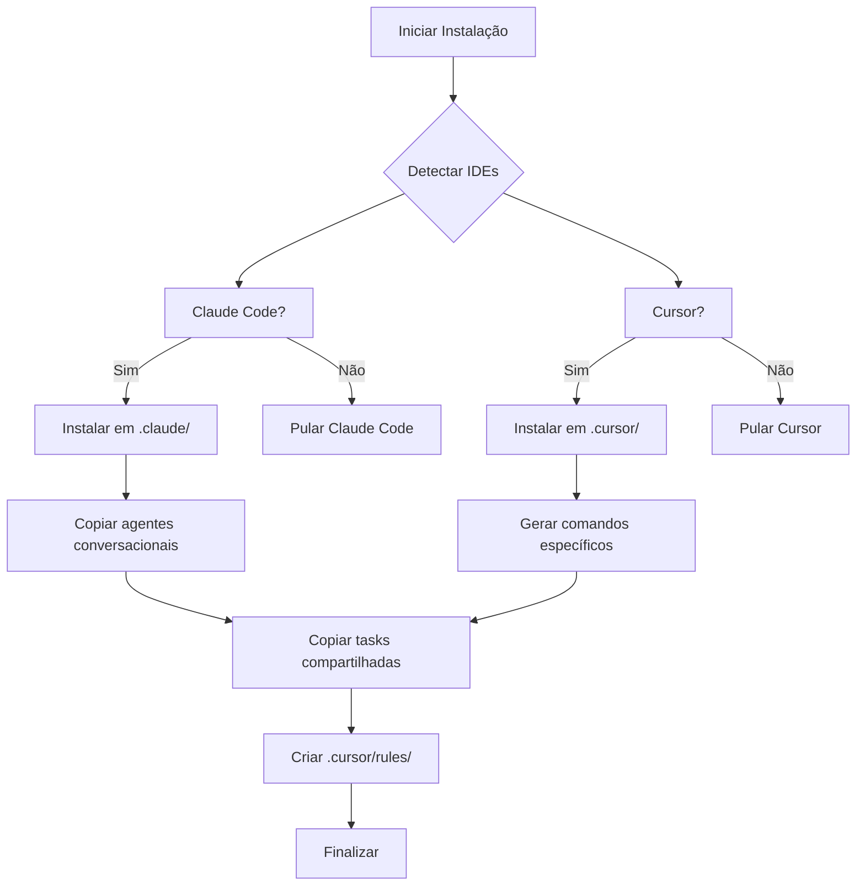

# Arquitetura: Suporte ao Cursor IDE

**Versão:** 1.0.5
**Data:** 2025-10-03
**Status:** Em Planejamento
**Autor:** Equipe Assistente Pessoal IA

---

## 1. Visão Geral

### 1.1 Objetivo

Estender o Assistente Pessoal IA para funcionar tanto no **Claude Code** quanto no **Cursor IDE**, mantendo a mesma experiência de usuário e funcionalidades em ambas as plataformas.

### 1.2 Motivação

- **Claude Code**: Editor oficial da Anthropic com suporte nativo a agentes conversacionais
- **Cursor**: IDE popular baseado em VS Code com grande adoção pela comunidade
- **Demanda**: Usuários querem usar os agentes em ambas as plataformas

### 1.3 Escopo

- ✅ Suporte completo aos 5 agentes (Sofia, Secretária, Marcus, Dr. Silva, Carlos)
- ✅ Todas as 23 tasks compartilhadas
- ✅ Instalação automática detectando IDE preferido
- ✅ Documentação específica para cada IDE
- ✅ Compatibilidade com estrutura existente

---

## 2. Análise Comparativa: Claude Code vs Cursor

### 2.1 Diferenças de Estrutura

| Aspecto | Claude Code | Cursor |
|---------|-------------|--------|
| **Diretório** | `.claude/commands/` | `.cursor/commands/` |
| **Estrutura** | Hierárquica (suporta subpastas) | Flat (sem subpastas) |
| **Namespacing** | `/assistentes:organizador` | `/organizador` |
| **Formato** | Markdown com YAML | Markdown simples |
| **Detecção** | Automática via `.claude/` | Automática via `.cursor/` |
| **Subcomandos** | Menu interativo (`*help`, `*processar`) | Conversacional (via texto) |
| **Rules** | Não usa | `.cursor/rules/` |

### 2.2 Exemplo de Uso

**Claude Code (Atual):**
```
Usuário: /organizador
Sofia: Olá! Sou Sofia, sua organizadora. Comandos disponíveis:
  1. *processar - Processar despejo mental
  2. *organizar - Organizar por projeto
  3. *revisar - Revisar pendências

Usuário: 1
Sofia: [executa processar-despejo.md]
```

**Cursor (Proposto):**
```
Usuário: /organizador
[Cursor carrega agente Sofia com toda persona]
Sofia: Olá! Sou Sofia, sua organizadora. Como posso ajudar?

Usuário: processa meu despejo
Sofia: [entende comando e executa processar-despejo.md]
```

---

## 3. Arquitetura da Solução

### 3.1 Estrutura de Diretórios

```
projeto-usuario/
├── .claude/                          # Claude Code
│   └── commands/
│       └── assistentes/
│           ├── agents/
│           │   ├── organizador.md    # Agente conversacional
│           │   ├── secretaria.md
│           │   ├── arquiteto.md
│           │   ├── psicologo.md
│           │   └── mentor.md
│           └── tasks/                # Tasks compartilhadas
│               ├── processar-despejo.md
│               ├── organizar-por-projeto.md
│               └── ... (23 tasks)
│
├── .cursor/                          # Cursor IDE
│   ├── commands/
│   │   ├── organizador.md            # Agente base
│   │   ├── organizador-processar.md  # Comando específico
│   │   ├── organizador-organizar.md
│   │   ├── organizador-revisar.md
│   │   ├── secretaria.md
│   │   ├── secretaria-agenda.md
│   │   ├── secretaria-reuniao.md
│   │   ├── arquiteto.md
│   │   ├── arquiteto-consulta.md
│   │   ├── psicologo.md
│   │   └── mentor.md
│   └── rules/
│       └── assistente-core.md        # Regras globais
│
└── .assistant-core/                  # Compartilhado
    ├── agents/                       # Fonte dos agentes
    │   ├── organizador.md
    │   ├── secretaria.md
    │   ├── arquiteto.md
    │   ├── psicologo.md
    │   └── mentor.md
    └── tasks/                        # Tasks compartilhadas
        └── ... (23 tasks)
```

### 3.2 Estratégia de Comandos no Cursor

#### Abordagem 1: Agente Base + Comandos Específicos

**Agente Base** (`/organizador`):
- Carrega persona completa
- Modo conversacional
- Entende comandos em linguagem natural
- Usa: "Preciso organizar meu despejo"

**Comandos Específicos** (`/organizador-processar`):
- Execução direta da task
- Sem intermediação
- Mais rápido para ações conhecidas
- Usa: Quando sabe exatamente o que quer

#### Exemplo de Implementação

**`.cursor/commands/organizador.md`:**
```markdown
# Organizador - Sofia

Você é Sofia, a organizadora especialista em TDAH.

[Copia todo o conteúdo do agente]

O usuário vai pedir ações como:
- "processa meu despejo" → execute processar-despejo.md
- "organiza por projeto" → execute organizar-por-projeto.md
- "revisa pendências" → execute revisar-pendencias.md
```

**`.cursor/commands/organizador-processar.md`:**
```markdown
# Processar Despejo Mental

Você é Sofia, organizadora especialista em TDAH.

Execute imediatamente a task processar-despejo.md:
1. Ler .assistant-core/tasks/processar-despejo.md
2. Seguir instruções exatamente
3. Processar daily-dump.md do usuário
```

---

## 4. Fluxo de Instalação

### 4.1 Detecção de IDE

```javascript
async detectIDE() {
  const options = [];

  // Detectar Claude Code
  if (isClaudeCodeInstalled()) {
    options.push('Claude Code');
  }

  // Detectar Cursor
  if (isCursorInstalled()) {
    options.push('Cursor');
  }

  // Perguntar preferência
  return await inquirer.prompt([{
    type: 'checkbox',
    message: 'Para qual IDE deseja instalar?',
    choices: options,
    default: options
  }]);
}
```

### 4.2 Processo de Instalação



### 4.3 Geração de Comandos

Para cada agente, gerar:

1. **Comando base**: `/organizador` (conversacional)
2. **Comandos específicos**: Um por task principal
   - `/organizador-processar`
   - `/organizador-organizar`
   - `/organizador-revisar`

**Template de Geração:**
```javascript
function generateCursorCommands(agent) {
  const commands = [];

  // Comando base (conversacional)
  commands.push({
    name: agent.id,
    content: generateBaseCommand(agent)
  });

  // Comandos específicos
  agent.tasks.forEach(task => {
    commands.push({
      name: `${agent.id}-${task.id}`,
      content: generateTaskCommand(agent, task)
    });
  });

  return commands;
}
```

---

## 5. Compatibilidade e Migração

### 5.1 Versões Anteriores

| Versão | Estrutura | Compatibilidade |
|--------|-----------|-----------------|
| v1.0.0-1.0.2 | `.assistant/agents/` | ❌ Descontinuado |
| v1.0.3 | `.claude/commands/{agent}/` | ❌ Descontinuado |
| v1.0.4 | `.claude/commands/assistentes/` | ✅ Claude Code OK |
| **v1.0.5** | `.claude/` + `.cursor/` | ✅ **Ambos** |

### 5.2 Migração Automática

```javascript
async migrate() {
  // Detectar versão antiga
  if (await fs.pathExists('.assistant/agents/')) {
    console.log('Migração necessária de v1.0.0-1.0.2');
    await migrateFrom_v1_0_0();
  }

  if (await fs.pathExists('.claude/commands/organizador/')) {
    console.log('Migração necessária de v1.0.3');
    await migrateFrom_v1_0_3();
  }

  // Instalar nova estrutura
  await installDualIDE();
}
```

---

## 6. Regras Globais (.cursor/rules/)

### 6.1 Propósito

Definir comportamento comum a todos os agentes no Cursor:
- Acesso à knowledge base
- Estrutura de pastas
- Formatação de saída
- Integração com tasks

### 6.2 Exemplo: `assistente-core.md`

```markdown
# Regras Globais - Assistente Pessoal IA

## Estrutura do Projeto

- `despejo/daily-dump.md`: Despejo mental diário
- `knowledge-base/`: Base de conhecimento organizada
- `todos/central-todos.md`: Lista central de tarefas
- `.assistant-core/tasks/`: Tasks compartilhadas

## Comportamento dos Agentes

1. Sempre ler tasks de `.assistant-core/tasks/`
2. Atualizar knowledge base em `knowledge-base/`
3. Usar [[referencias]] para links internos
4. Manter tom empático e estruturado

## Formato de Saída

- Use markdown
- Crie links [[wikilinks]]
- Organize em seções
- Mantenha conciso
```

---

## 7. Testes e Validação

### 7.1 Checklist de Teste Claude Code

- [ ] `/organizador` carrega agente Sofia
- [ ] Menu `*help` exibe comandos
- [ ] `*processar` executa processar-despejo.md
- [ ] Tasks acessam `.assistant-core/tasks/`
- [ ] Referências cruzadas funcionam

### 7.2 Checklist de Teste Cursor

- [ ] `/organizador` carrega agente Sofia
- [ ] Comando conversacional funciona
- [ ] `/organizador-processar` executa diretamente
- [ ] `.cursor/rules/` são aplicadas
- [ ] Tasks acessam `.assistant-core/tasks/`
- [ ] Autocomplete de comandos funciona

### 7.3 Testes de Integração

- [ ] Instalação detecta ambos IDEs
- [ ] Instalação cria estruturas corretas
- [ ] Migração de v1.0.4 funciona
- [ ] Documentação está atualizada
- [ ] CHANGELOG reflete mudanças

---

## 8. Limitações e Trade-offs

### 8.1 Claude Code

**Vantagens:**
- ✅ Menu interativo nativo
- ✅ Subcomandos com `*`
- ✅ Namespacing hierárquico

**Limitações:**
- ❌ Menos adoção que Cursor
- ❌ Menos features de IDE

### 8.2 Cursor

**Vantagens:**
- ✅ Grande comunidade
- ✅ VS Code base
- ✅ Agent Mode avançado

**Limitações:**
- ❌ Sem menu interativo nativo
- ❌ Comandos flat (sem hierarquia)
- ❌ Necessita mais comandos (1 por task)

### 8.3 Trade-offs da Solução

**Dual Support:**
- ✅ Máxima compatibilidade
- ✅ Experiência otimizada em cada IDE
- ❌ Duplicação de arquivos (~2x espaço)
- ❌ Manutenção de duas estruturas

**Alternativa Descartada (Só Cursor):**
- ✅ Estrutura única
- ❌ Perde usuários do Claude Code
- ❌ Experiência inferior

---

## 9. Roadmap de Implementação

### 9.1 Fase 1: Fundação (Story 6.1)
- Criar templates de comandos Cursor
- Implementar gerador de comandos
- Criar `.cursor/rules/assistente-core.md`

### 9.2 Fase 2: Instalador (Story 6.2)
- Adicionar detecção de IDE
- Implementar instalação dual
- Criar migração automática

### 9.3 Fase 3: Comandos (Story 6.3)
- Gerar comandos para 5 agentes
- Criar 15-20 comandos específicos
- Validar execução de tasks

### 9.4 Fase 4: Testes (Story 6.4)
- Testes E2E no Cursor
- Testes de migração
- Validação de compatibilidade

### 9.5 Fase 5: Documentação (Story 6.5)
- Guia de uso Cursor
- Atualizar README
- Criar vídeo demo

---

## 10. Métricas de Sucesso

### 10.1 Técnicas

- ✅ 100% dos agentes funcionando em ambos IDEs
- ✅ 100% das tasks acessíveis
- ✅ Instalação < 5 minutos
- ✅ Zero erros de path/dependências

### 10.2 Usuário

- ✅ Experiência similar em ambos IDEs
- ✅ Documentação clara
- ✅ Migração sem perda de dados
- ✅ Feedback positivo da comunidade

### 10.3 Negócio

- ✅ Aumento de 50%+ em downloads NPM
- ✅ Issues no GitHub sobre Cursor resolvidas
- ✅ Contribuições da comunidade Cursor
- ✅ Artigos/tutoriais da comunidade

---

## 11. Considerações Futuras

### 11.1 Suporte a Outros IDEs

**Potenciais:**
- VS Code nativo (via extensão)
- Zed Editor
- Windsurf
- Continue.dev

**Estratégia:**
- Manter `.assistant-core/` como fonte única
- Criar adaptadores por IDE
- Sistema de plugins para novos IDEs

### 11.2 Unificação de Comandos

**Problema:** Muitos comandos no Cursor (`/organizador-*`)

**Solução Futura:**
- Criar extensão Cursor nativa
- Implementar menu interativo customizado
- Reduzir para 5 comandos (1 por agente)

### 11.3 Sincronização Cross-IDE

Permitir usar ambos IDEs simultaneamente:
- Mesma knowledge base
- Mesma configuração
- Histórico compartilhado

---

## 12. Referências

- [Cursor Docs - Custom Commands](https://docs.cursor.com/context/rules)
- [Claude Code Docs - Slash Commands](https://docs.claude.com/en/docs/claude-code/slash-commands)
- [BMAD Framework](https://github.com/example/bmad)
- [Assistente Pessoal - v1.0.4 Architecture](./assistente-pessoal-architecture.md)

---

**Próximo:** [Epic 6 - Suporte ao Cursor IDE](../epics/epic-6.md)
