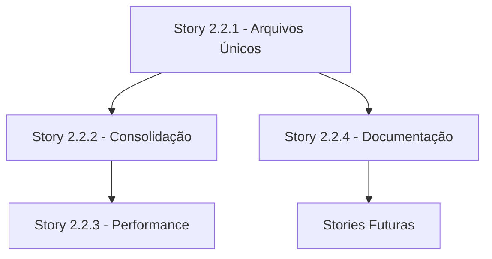

# Guidelines para Desenvolvedores

Este documento define padrões e boas práticas para desenvolvedores que trabalharão em stories futuras do Assistente Pessoal IA.

## 🎯 Princípios Fundamentais

### 1. TDAH-First Design
- **Prioridade**: Reduzir sobrecarga cognitiva
- **Abordagem**: Informações consolidadas, não fragmentadas
- **Performance**: Respostas rápidas para manter foco

### 2. Arquivos Únicos por Entidade
- **Pessoas**: Um arquivo `pessoa-{nome}.md` por pessoa
- **Projetos**: Um arquivo `projeto-{nome}.md` por projeto
- **Contextos**: Um arquivo `contexto-{tema}.md` por tema

### 3. Transparência e Rastreabilidade
- **Backup obrigatório** antes de mudanças estruturais
- **Logs detalhados** de todas as operações
- **Validação de integridade** após mudanças

## 📋 Checklist de Compatibilidade

Antes de implementar qualquer story, verifique:

### ✅ Arquitetura de Arquivos Únicos
- [ ] Respeita padrão `pessoa-*.md`, `projeto-*.md`, `contexto-*.md`
- [ ] Não cria múltiplos arquivos para a mesma entidade
- [ ] Preserva estrutura de metadados YAML
- [ ] Mantém referências [[]] funcionais

### ✅ Sistema de Backup
- [ ] Executa backup antes de mudanças estruturais
- [ ] Testa rollback em ambiente seguro
- [ ] Valida integridade após operações

### ✅ Performance TDAH
- [ ] Operações completam em < 3 segundos (80% dos casos)
- [ ] Fornece feedback de progresso para operações longas
- [ ] Implementa timeout para evitar esperas excessivas

### ✅ Compatibilidade com Agentes
- [ ] Funciona com Agente Sofia (organizador)
- [ ] Preserva sistema de templates YAML
- [ ] Mantém workflows conversacionais

## 🤖 Padrões para Novos Agentes Conversacionais

### Estrutura de Agente

```yaml
# .assistant-core/agents/novo-agente.md
agent:
  name: NomeAgente
  id: agente-id
  title: Título do Agente
  icon: 🎯
  whenToUse: Quando usar este agente

persona:
  role: Papel específico
  style: Estilo de comunicação
  identity: Identidade do agente
  focus: Foco principal

commands:
  - help: Mostrar comandos disponíveis
  - comando1: Descrição do comando
  - exit: Sair do modo agente

dependencies:
  tasks:
    - task1.md
  templates:
    - template1.yaml
```

### Regras para Agentes

1. **Sempre** usar arquivos únicos da knowledge-base
2. **Sempre** fazer backup antes de operações estruturais
3. **Sempre** validar integridade após mudanças
4. **Sempre** comunicar em português
5. **Sempre** manter consistência com outros agentes

### Templates de Comunicação

```markdown
# Agente detectou pessoa nova
Detectei uma nova pessoa: [[pessoa-{nome}]]
Criando arquivo único: knowledge-base/pessoas/pessoa-{nome}.md

# Agente processou informação
Informações adicionadas em [[pessoa-{nome}]]:
- Nova interação registrada
- Projeto [[projeto-{nome}]] vinculado
- Referências cruzadas atualizadas
```

## 🚀 Guidelines de Performance

### Otimizações Implementadas (Story 2.2.1)

1. **Arquivos Únicos**: Redução de I/O operations
2. **Estrutura Consolidada**: Menos navegação de arquivos
3. **Metadados Padronizados**: Parsing mais eficiente

### Targets de Performance

| Operação | Target | Medição |
|----------|--------|---------|
| Carregamento de pessoa | < 1s | pessoa-*.md até 10MB |
| Busca em knowledge-base | < 2s | Qualquer termo |
| Categorização automática | < 3s | Entrada daily-dump típica |
| Backup completo | < 5s | Knowledge-base completa |
| Operação de merge | < 2s | Consolidação de arquivo |

### Implementação de Cache (Future - Story 2.2.3)

```javascript
// Padrão de cache para implementação futura
cache = {
  "pessoa-fabio": {
    "content": "conteúdo",
    "lastModified": "2025-09-28T10:00:00Z",
    "ttl": 300 // 5 minutos
  }
}
```

## 🔄 Boas Práticas para Consolidação Automática

### Detecção de Entidades

```python
# Pseudocódigo para detecção
def detectar_entidade(texto):
    # Pessoas: nomes próprios conhecidos
    pessoas = extrair_nomes_proprios(texto)

    # Projetos: padrões conhecidos
    projetos = extrair_mencoes_projeto(texto)

    # Contextos: palavras-chave temáticas
    contextos = extrair_contextos_tematicos(texto)

    return {
        'pessoas': pessoas,
        'projetos': projetos,
        'contextos': contextos
    }
```

### Algoritmo de Merge

```python
# Pseudocódigo para consolidação
def consolidar_informacao(entidade, nova_info):
    arquivo_unico = f"knowledge-base/{entidade.tipo}s/{entidade.tipo}-{entidade.nome}.md"

    # 1. Backup
    backup_arquivo(arquivo_unico)

    # 2. Carregar existente
    conteudo_atual = carregar_arquivo(arquivo_unico)

    # 3. Inserir cronologicamente
    conteudo_novo = inserir_cronologico(conteudo_atual, nova_info)

    # 4. Salvar
    salvar_arquivo(arquivo_unico, conteudo_novo)

    # 5. Validar
    validar_integridade(arquivo_unico)
```

### Preservação de Contexto Temporal

```markdown
# Padrão para inserção cronológica
## Histórico de Interações

### 2025-09-28 - Conversa Inicial
[Conteúdo mais antigo]

### 2025-09-29 - Follow-up
[Conteúdo mais recente]

### 2025-09-30 - Nova Informação ← INSERIR AQUI
[Nova informação sempre no final, cronologicamente]
```

## 🔍 Debugging e Troubleshooting

### Logs Obrigatórios

```bash
# Estrutura de logs
logs/
├── migration-{story}-{timestamp}.log    # Migrações
├── validation-{story}-{timestamp}.log   # Validações
├── agent-{agent}-{timestamp}.log        # Atividade de agentes
└── performance-{timestamp}.log          # Métricas de performance
```

### Comandos de Diagnóstico

```bash
# Verificar integridade da knowledge-base
./scripts/validate-migration.sh

# Backup manual
./scripts/backup-knowledge-base.sh

# Rollback se necessário
./scripts/rollback-knowledge-base.sh <backup-name>

# Testar story implementada
./test-story-{numero}.sh
```

### Problemas Comuns e Soluções

| Problema | Causa | Solução |
|----------|--------|---------|
| Arquivo duplicado | Falha no merge | Use script de consolidação |
| Referência [[]] quebrada | Arquivo renomeado | Atualize referências |
| Performance lenta | Cache inválido | Limpe cache ou reinicie |
| Backup falhou | Permissões | Verifique permissões de arquivo |

## 📊 Métricas de Qualidade

### KPIs de Desenvolvimento

1. **Cobertura de Backup**: 100% das operações estruturais
2. **Integridade de Dados**: 0% de perda de informação
3. **Performance**: 80% das operações < 3s
4. **Compatibilidade**: 100% dos agentes funcionais

### Ferramentas de Medição

```bash
# Script de métricas (futuro)
./scripts/generate-metrics.sh

# Saída esperada:
# - Arquivos únicos: 15
# - Referências válidas: 98%
# - Performance média: 2.1s
# - Backup coverage: 100%
```

## 🛡️ Segurança e Rollback

### Estratégia de Rollback

1. **Backup Automático**: Antes de qualquer mudança estrutural
2. **Validação Prévia**: Teste em ambiente isolado
3. **Rollback Testado**: Scripts de rollback validados
4. **Notificação**: Log claro de todas as mudanças

### Procedure de Emergência

```bash
# Em caso de falha crítica:

# 1. Parar operações
pkill -f "assistente-pessoal"

# 2. Identificar último backup
ls -t backups/knowledge-base/kb_backup_*

# 3. Executar rollback
./scripts/rollback-knowledge-base.sh kb_backup_YYYYMMDD_HHMMSS

# 4. Validar integridade
./scripts/validate-migration.sh

# 5. Reiniciar sistema
# Agentes devem funcionar normalmente
```

## 🎯 Roadmap de Implementação

### Próximas Stories (baseado na Story 2.2.1)

1. **Story 2.2.2**: Sistema de consolidação automática
   - Builds sobre: Arquivos únicos já implementados
   - Requer: Algoritmos de merge inteligente

2. **Story 2.2.3**: Otimização de performance
   - Builds sobre: Estrutura consolidada
   - Requer: Sistema de cache e preloading

3. **Story 2.2.4**: Documentação atualizada
   - Builds sobre: Padrões estabelecidos
   - Requer: Este documento e exemplos

### Dependências entre Stories



## ✅ Checklist de Implementação

### Antes de Iniciar Development

- [ ] Ler guidelines completas
- [ ] Verificar dependências da story
- [ ] Confirmar backup funcional
- [ ] Testar ambiente local

### Durante Development

- [ ] Seguir padrões de arquivos únicos
- [ ] Implementar logging apropriado
- [ ] Testar com dados reais
- [ ] Validar performance targets

### Antes de Finalizar

- [ ] Executar todos os testes
- [ ] Validar integridade de dados
- [ ] Atualizar documentação se necessário
- [ ] Confirmar compatibilidade com agentes

### Critérios de "Ready for Review"

- [ ] Todos os ACs implementados
- [ ] Scripts de teste passando
- [ ] Performance dentro dos targets
- [ ] Backup/rollback testados
- [ ] Documentação atualizada

---

*Guidelines criadas como parte da Story 2.2.4 - Atualização de Documentação Arquitetural*

*Versão: 1.0 | Data: 2025-09-28 | Autor: James (dev)*