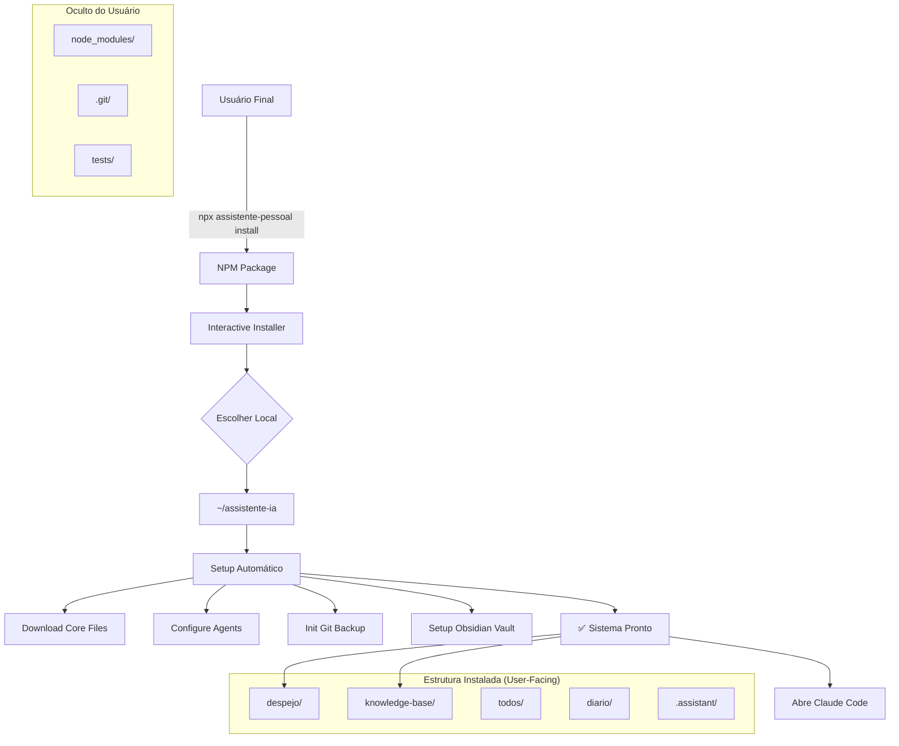

# Transformação User-First: De Projeto Dev para Produto End-User

**Autor**: Winston (Architect)
**Data**: 02/10/2025
**Status**: Proposta Arquitetural

---

## 🎯 Problema Identificado

**Gap Crítico**: O Assistente Pessoal IA está estruturado como **projeto de desenvolvimento** ao invés de **produto para usuário final**.

### Evidências do Problema

| Aspecto | Estado Atual (Dev-First) | Estado Desejado (User-First) |
|---------|--------------------------|------------------------------|
| **Instalação** | `git clone` + manual setup | `npx assistente-pessoal install` |
| **README** | Foco em desenvolvimento, testes, arquitetura | Foco em benefícios, quick start, uso |
| **Estrutura** | Arquivos de dev visíveis (tests/, .bmad-core/, docs/) | Apenas essenciais para usuário |
| **Documentação** | Técnica e fragmentada | User-friendly e progressive disclosure |
| **Setup** | Multi-step manual | One-command automated |
| **Updates** | Git pull + manual merge | `npx assistente-pessoal update` |

### Comparação com BMAD Method

**BMAD (Referência Excelente)**:
```bash
npx bmad-method install
# → Interactive terminal installer
# → User picks location
# → Automated setup
# → Ready to use
```

**Assistente Atual (Problemático)**:
```bash
git clone <repo>
cd assistente-pessoal-ia
bash setup.sh
# → Many manual steps
# → Confusing for non-devs
```

---

## 🏗️ Solução Arquitetural: Package NPM + Installer

### Visão de Alto Nível



### Arquitetura do NPM Package

**Nome do Package**: `@assistente-ia/core` ou `assistente-pessoal-ia`

**Estrutura do Package**:
```
assistente-pessoal-ia/  (NPM package - GitHub)
├── package.json               # NPM config
├── bin/
│   └── cli.js                 # Entry point (npx assistente-pessoal)
├── src/
│   ├── installer/             # Interactive installer
│   │   ├── prompts.js         # User questions (inquirer)
│   │   ├── downloader.js      # Download core files
│   │   └── setup.js           # Setup automation
│   ├── updater/               # Update system
│   └── templates/             # Core files to install
│       ├── agents/
│       ├── knowledge-base/
│       └── scripts/
├── templates/                 # Files copied to user location
│   ├── .assistant/            # Renamed from .assistant-core
│   │   ├── agents/
│   │   ├── memory/
│   │   └── config.yaml
│   ├── despejo/
│   ├── knowledge-base/
│   ├── todos/
│   └── diario/
└── README.md                  # USER-FIRST README

# DEVELOPMENT FILES (não incluídos no package)
.npmignore                     # Exclude dev files
├── tests/                     # Not published
├── docs/architecture/         # Not published (só docs user-facing)
└── .bmad-core/               # Not published
```

---

## 📦 Implementação Técnica

### 1. package.json

```json
{
  "name": "assistente-pessoal-ia",
  "version": "1.0.0",
  "description": "Assistente Pessoal IA - Seu segundo cérebro para TDAH",
  "bin": {
    "assistente-pessoal": "./bin/cli.js",
    "assistente-ia": "./bin/cli.js"
  },
  "scripts": {
    "install-user": "node bin/cli.js install",
    "update-user": "node bin/cli.js update"
  },
  "keywords": [
    "assistente-pessoal",
    "tdah",
    "adhd",
    "segundo-cerebro",
    "obsidian",
    "knowledge-base"
  ],
  "author": "Seu Nome",
  "license": "MIT",
  "dependencies": {
    "inquirer": "^9.0.0",
    "chalk": "^5.0.0",
    "ora": "^7.0.0",
    "fs-extra": "^11.0.0",
    "simple-git": "^3.0.0"
  },
  "files": [
    "bin/",
    "src/",
    "templates/",
    "README.md",
    "LICENSE"
  ]
}
```

### 2. bin/cli.js (Entry Point)

```javascript
#!/usr/bin/env node

const { program } = require('commander');
const chalk = require('chalk');
const installer = require('../src/installer');
const updater = require('../src/updater');

program
  .name('assistente-pessoal')
  .description('Assistente Pessoal IA - Seu segundo cérebro para TDAH')
  .version('1.0.0');

program
  .command('install')
  .description('Instalar o Assistente Pessoal IA')
  .option('-p, --path <path>', 'Caminho de instalação')
  .action(async (options) => {
    console.log(chalk.blue.bold('\n🤖 Assistente Pessoal IA - Instalador\n'));
    await installer.run(options);
  });

program
  .command('update')
  .description('Atualizar o Assistente para a versão mais recente')
  .action(async () => {
    await updater.run();
  });

program
  .command('doctor')
  .description('Verificar saúde da instalação')
  .action(async () => {
    const doctor = require('../src/doctor');
    await doctor.run();
  });

program.parse();
```

### 3. src/installer/prompts.js (Interactive Installer)

```javascript
const inquirer = require('inquirer');
const os = require('os');
const path = require('path');
const chalk = require('chalk');

async function getInstallationPreferences() {
  console.log(chalk.cyan('\n📋 Configuração da Instalação\n'));

  const answers = await inquirer.prompt([
    {
      type: 'input',
      name: 'installPath',
      message: 'Onde deseja instalar o Assistente?',
      default: path.join(os.homedir(), 'assistente-ia'),
      validate: (input) => {
        return input.length > 0 ? true : 'Por favor, forneça um caminho válido';
      }
    },
    {
      type: 'confirm',
      name: 'setupGit',
      message: 'Deseja configurar backup automático com Git?',
      default: true
    },
    {
      type: 'input',
      name: 'userName',
      message: 'Seu nome (para personalização dos agentes):',
      when: (answers) => answers.setupGit,
      validate: (input) => input.length > 0 ? true : 'Nome é obrigatório'
    },
    {
      type: 'confirm',
      name: 'setupObsidian',
      message: 'Configurar integração com Obsidian?',
      default: true
    },
    {
      type: 'confirm',
      name: 'openAfterInstall',
      message: 'Abrir no Claude Code após instalação?',
      default: true
    }
  ]);

  return answers;
}

async function confirmInstallation(preferences) {
  console.log(chalk.yellow('\n📦 Resumo da Instalação:\n'));
  console.log(`  Local: ${chalk.green(preferences.installPath)}`);
  console.log(`  Backup Git: ${preferences.setupGit ? chalk.green('Sim') : chalk.gray('Não')}`);
  console.log(`  Obsidian: ${preferences.setupObsidian ? chalk.green('Sim') : chalk.gray('Não')}`);
  console.log(`  Nome: ${chalk.green(preferences.userName || 'Não configurado')}`);

  const { confirm } = await inquirer.prompt([
    {
      type: 'confirm',
      name: 'confirm',
      message: 'Confirmar instalação?',
      default: true
    }
  ]);

  return confirm;
}

module.exports = {
  getInstallationPreferences,
  confirmInstallation
};
```

### 4. src/installer/setup.js (Setup Automation)

```javascript
const fs = require('fs-extra');
const path = require('path');
const chalk = require('chalk');
const ora = require('ora');
const simpleGit = require('simple-git');

class AssistenteSetup {
  constructor(preferences) {
    this.preferences = preferences;
    this.installPath = preferences.installPath;
  }

  async run() {
    console.log(chalk.blue.bold('\n🚀 Iniciando instalação...\n'));

    await this.createDirectoryStructure();
    await this.copyTemplateFiles();
    await this.setupGitIfEnabled();
    await this.setupObsidianIfEnabled();
    await this.createWelcomeFiles();

    this.printSuccessMessage();
  }

  async createDirectoryStructure() {
    const spinner = ora('Criando estrutura de diretórios...').start();

    const dirs = [
      'despejo',
      'knowledge-base',
      'todos',
      'diario',
      '.assistant/agents',
      '.assistant/memory',
      '.assistant/data'
    ];

    for (const dir of dirs) {
      await fs.ensureDir(path.join(this.installPath, dir));
    }

    spinner.succeed('Estrutura de diretórios criada');
  }

  async copyTemplateFiles() {
    const spinner = ora('Copiando arquivos do sistema...').start();

    const templatesDir = path.join(__dirname, '../../templates');
    await fs.copy(templatesDir, this.installPath, {
      overwrite: false,
      errorOnExist: false
    });

    spinner.succeed('Arquivos do sistema copiados');
  }

  async setupGitIfEnabled() {
    if (!this.preferences.setupGit) return;

    const spinner = ora('Configurando backup automático...').start();

    const git = simpleGit(this.installPath);

    await git.init();
    await git.addConfig('user.name', this.preferences.userName);
    await git.addConfig('user.email', `${this.preferences.userName}@assistente-ia.local`);

    // Create .gitignore
    const gitignore = `
# Arquivos temporários
.DS_Store
*.tmp
*.log

# Node modules (se houver)
node_modules/

# Arquivos pessoais sensíveis (descomentar se necessário)
# diario/
# .assistant/memory/
`;
    await fs.writeFile(path.join(this.installPath, '.gitignore'), gitignore);

    await git.add('./*');
    await git.commit('🎉 Instalação inicial do Assistente Pessoal IA');

    spinner.succeed('Backup automático configurado');
  }

  async setupObsidianIfEnabled() {
    if (!this.preferences.setupObsidian) return;

    const spinner = ora('Configurando Obsidian...').start();

    const obsidianDir = path.join(this.installPath, 'knowledge-base', '.obsidian');
    await fs.ensureDir(obsidianDir);

    // Copy pre-configured Obsidian settings
    const obsidianConfig = {
      name: 'Assistente Pessoal IA',
      theme: 'moonstone',
      // ... mais configurações
    };

    await fs.writeJSON(
      path.join(obsidianDir, 'app.json'),
      obsidianConfig,
      { spaces: 2 }
    );

    spinner.succeed('Obsidian configurado');
  }

  async createWelcomeFiles() {
    const spinner = ora('Criando arquivos de boas-vindas...').start();

    // despejo/daily-dump.md
    const dumpContent = `# 📝 Despejo Diário

Bem-vindo ao seu Assistente Pessoal IA!

Este arquivo é seu **ponto de captura rápida**. Simplesmente despeje aqui tudo que está na sua mente:

- Ideias
- Tarefas
- Pensamentos
- Qualquer coisa!

**Exemplo:**
reunião com João amanhã 14h
implementar feature X
comprar leite

Depois execute: \`/organizador processar\` para organizar tudo automaticamente!

---

`;
    await fs.writeFile(
      path.join(this.installPath, 'despejo', 'daily-dump.md'),
      dumpContent
    );

    // knowledge-base/BEM-VINDO.md
    const welcomeContent = `# 🤖 Bem-vindo ao Assistente Pessoal IA!

${this.preferences.userName ? `Olá, **${this.preferences.userName}**! ` : ''}Seu segundo cérebro está pronto para uso.

## 🚀 Primeiros Passos

1. **Capture**: Abra \`despejo/daily-dump.md\` e despeje informações
2. **Organize**: Execute \`/organizador processar\` no Claude Code
3. **Explore**: Use os outros agentes conforme necessidade

## 🤖 Seus Agentes

- **Sofia** (\`/organizador\`) - Organiza seu despejo
- **Secretária** - Gestão executiva e reuniões
- **Marcus** (\`/arquiteto\`) - Consultoria técnica
- **Dr. Helena** (\`/psicologo\`) - Suporte TDAH
- **Leonardo** (\`/mentor\`) - Desenvolvimento de carreira

## 📚 Documentação

- [Guia Completo](USAGE.md)
- [Perguntas Frequentes](FAQ.md)
- [Resolução de Problemas](TROUBLESHOOTING.md)

---

💡 **Dica**: Explore a pasta \`knowledge-base/\` no Obsidian para ver conexões!
`;
    await fs.writeFile(
      path.join(this.installPath, 'knowledge-base', 'BEM-VINDO.md'),
      welcomeContent
    );

    spinner.succeed('Arquivos de boas-vindas criados');
  }

  printSuccessMessage() {
    console.log(chalk.green.bold('\n✅ Instalação concluída com sucesso!\n'));
    console.log(chalk.cyan('📂 Local de instalação:'));
    console.log(chalk.white(`   ${this.installPath}\n`));

    console.log(chalk.cyan('🚀 Próximos passos:\n'));
    console.log(chalk.white('   1. Abra o Claude Code nesta pasta'));
    console.log(chalk.white('   2. Execute: /organizador'));
    console.log(chalk.white('   3. Comece a usar seu segundo cérebro!\n'));

    if (this.preferences.setupObsidian) {
      console.log(chalk.cyan('📝 Obsidian:'));
      console.log(chalk.white(`   Abra "${path.join(this.installPath, 'knowledge-base')}" como vault\n`));
    }

    if (this.preferences.openAfterInstall) {
      console.log(chalk.yellow('🎯 Abrindo Claude Code...\n'));
      // TODO: Implementar abertura automática
    }
  }
}

module.exports = AssistenteSetup;
```

---

## 📄 Novo README.md (User-First)

```markdown
# 🤖 Assistente Pessoal IA

**Seu segundo cérebro para TDAH** - 5 agentes especializados que lembram de tudo por você.

> 💡 **Para pessoas com TDAH**: Capture rápido, organize depois. Zero fricção.

## ✨ O Que É?

Um assistente pessoal com **5 especialistas IA** que funcionam como seu cérebro externo:

- 🗂️ **Sofia** - Organiza sua bagunça mental
- 📊 **Secretária** - Gerencia projetos e reuniões
- 🏗️ **Marcus** - Consultor técnico confrontador
- 🧠 **Dr. Helena** - Psicólogo especialista em TDAH
- 🎯 **Leonardo** - Mentor de carreira

**Tudo 100% local e privado** - seus dados nunca saem do seu computador.

---

## 🚀 Instalação (2 minutos)

### Instalação Rápida

```bash
npx assistente-pessoal-ia install
```

Pronto! O instalador vai te guiar pelo resto.

### O Que Você Precisa

- Node.js 14+ ([instalar](https://nodejs.org))
- Claude Code ([usar gratuitamente](https://claude.ai/code))
- Obsidian (opcional, mas recomendado)

---

## 💡 Como Usar

### 1. Capture Tudo (sem pensar)

Abra `despejo/daily-dump.md` e despeje **tudo**:

```
reunião com João 14h
bug no login
ideia app fotos
comprar leite
```

### 2. Organize com IA

No Claude Code:

```
/organizador processar
```

Sofia vai categorizar tudo automaticamente!

### 3. Consulte os Especialistas

```
/secretaria "status dos projetos"
/arquiteto "como fazer autenticação JWT?"
/psicologo "estou sobrecarregado"
/mentor "como evoluir minha carreira?"
```

---

## 🎯 Por Que Usar?

| Problema TDAH | Solução do Assistente |
|---------------|----------------------|
| **Esqueço tudo** | Knowledge-base que nunca esquece |
| **Não consigo organizar** | IA organiza por você |
| **Procrastino sistemas complexos** | Captura em 5 segundos |
| **Preciso de múltiplas perspectivas** | 5 agentes especializados |
| **Perco contexto entre tarefas** | Memória contextual profunda |

---

## 📚 Documentação

- [📖 Guia Completo de Uso](docs/USAGE.md)
- [❓ Perguntas Frequentes](docs/FAQ.md)
- [🛠️ Resolução de Problemas](docs/TROUBLESHOOTING.md)
- [💾 Backup e Recovery](docs/BACKUP.md)

---

## 🆘 Precisa de Ajuda?

```bash
npx assistente-pessoal-ia doctor
```

Este comando verifica sua instalação e sugere correções.

---

## 🔐 Privacidade

✅ **100% Local** - Dados nunca saem do seu computador
✅ **Sem Telemetria** - Zero tracking
✅ **Open Source** - Código auditável
✅ **Backup Git** - Você controla tudo

---

## 🚀 Atualizações

```bash
npx assistente-pessoal-ia update
```

---

**Feito com 💙 para pessoas com TDAH**
```

---

## 🎨 UX Document Necessário

Crie documento separado para UX Expert definir:

1. **Onboarding Flow**
   - Perguntas do instalador (tom, ordem, defaults)
   - Welcome screens
   - First-time tutorials

2. **Error Messages**
   - User-friendly (não técnicas)
   - Actionable suggestions
   - Visual (emojis, cores)

3. **Documentation Tone**
   - Acessível para não-devs
   - TDAH-friendly (direto ao ponto)
   - Progressive disclosure (básico → avançado)

4. **File Naming**
   - User-facing vs technical
   - `.assistant/` vs `.assistant-core/`
   - Português vs English

---

## 📋 Roadmap de Implementação

### Fase 1: NPM Package Setup (1-2 dias)
- [ ] Criar package.json
- [ ] Implementar bin/cli.js
- [ ] Criar installer básico
- [ ] Testar instalação local

### Fase 2: Interactive Installer (2-3 dias)
- [ ] Implementar prompts.js (inquirer)
- [ ] Criar setup.js (automação)
- [ ] Adicionar doctor.js (health check)
- [ ] Testar fluxo completo

### Fase 3: Templates & Defaults (1 dia)
- [ ] Reorganizar templates/
- [ ] Criar welcome files
- [ ] Setup Obsidian defaults
- [ ] Git config automático

### Fase 4: Documentation Rewrite (2 dias)
- [ ] **NOVO README.md** (user-first)
- [ ] Mover docs técnicos para `/docs-dev`
- [ ] Criar docs user-facing
- [ ] FAQ + Troubleshooting

### Fase 5: Publishing (1 dia)
- [ ] Configurar .npmignore
- [ ] Testar `npm pack`
- [ ] Publicar no NPM
- [ ] Criar release notes

**Total Estimado**: ~7-9 dias de desenvolvimento

---

## 🎯 Critérios de Sucesso

**Instalação deve ser**:
- ✅ **One-command**: `npx assistente-pessoal-ia install`
- ✅ **Interactive**: Pergunta preferências ao usuário
- ✅ **Rápida**: < 2 minutos do comando ao uso
- ✅ **Non-technical**: Avó consegue instalar
- ✅ **Safe**: Não quebra instalações existentes

**Documentação deve ser**:
- ✅ **User-first**: README foca em benefícios, não em arquitetura
- ✅ **Progressive**: Básico fácil, avançado disponível
- ✅ **TDAH-friendly**: Direto, visual, sem enrolação
- ✅ **Actionable**: Sempre diz "faça X", não "entenda Y"

---

## 🤔 Questões para Decisão

1. **Nome do package NPM**:
   - `assistente-pessoal-ia` (mais descritivo)
   - `assistente-ia` (mais curto)
   - `@assistente/core` (scoped)

2. **Comando CLI**:
   - `npx assistente-pessoal install`
   - `npx assistente install`
   - `npx create-assistente-ia`

3. **Estrutura de pastas**:
   - `.assistant/` (mais user-friendly)
   - `.assistant-core/` (atual, mais técnico)

4. **Separação de repos**:
   - Monorepo (dev + user juntos)
   - Dual repos (dev separado, user limpo)

5. **Telemetria/Analytics**:
   - Nenhuma (privacidade total)
   - Opt-in anonymous (melhorar produto)

---

## 📞 Próximos Passos Recomendados

1. **Revisar este documento** com você
2. **Decidir questões em aberto** (nome, comando, etc)
3. **Criar Story no Epic 3 ou 5**: "Transformação User-First"
4. **Envolver UX Expert** para definir tom, mensagens, onboarding
5. **Implementar Fase 1** (NPM package setup)

---

**Winston (Architect)**
*"Transforme complexidade técnica em simplicidade para o usuário"*
