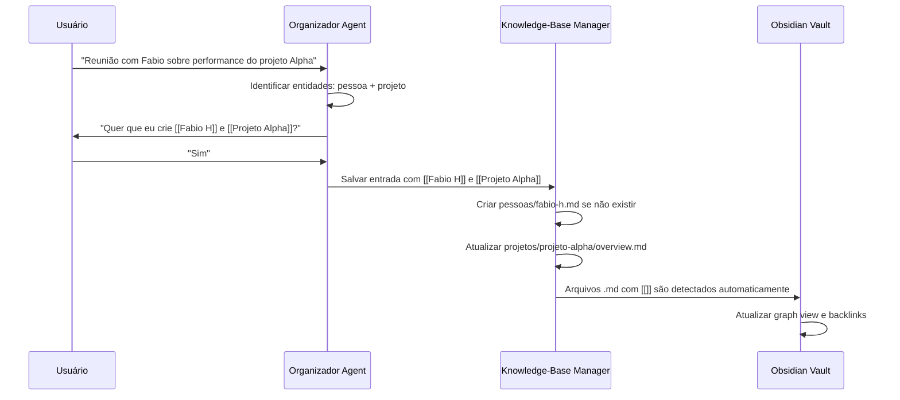
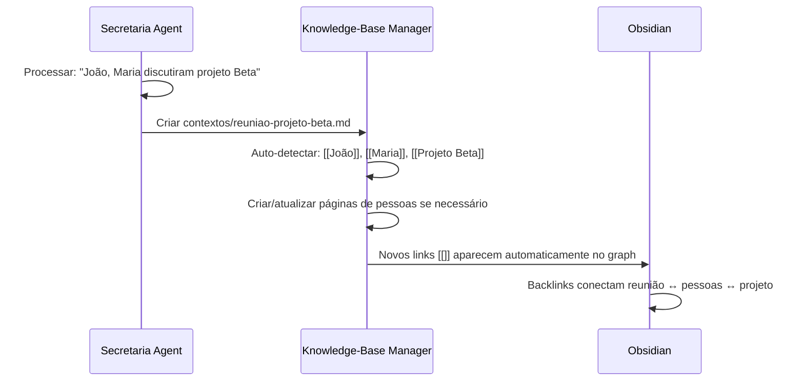

# Workflows Centrais

## Workflow 1: Processamento de Despejo com Referências [[]]

```mermaid
sequenceDiagram
    participant U as Usuário
    participant ORG as Organizador Agent
    participant KB as Knowledge-Base Manager
    participant OBS as Obsidian Vault

    U->>ORG: "Reunião com Fabio sobre performance do projeto Alpha"
    ORG->>ORG: Identificar entidades: pessoa + projeto
    ORG->>U: "Quer que eu crie [[Fabio H]] e [[Projeto Alpha]]?"
    U->>ORG: "Sim"
    ORG->>KB: Salvar entrada com [[Fabio H]] e [[Projeto Alpha]]
    KB->>KB: Criar pessoas/fabio-h.md se não existir
    KB->>KB: Atualizar projetos/projeto-alpha/overview.md
    KB->>OBS: Arquivos .md com [[]] são detectados automaticamente
    OBS->>OBS: Atualizar graph view e backlinks
```

## Workflow 2: Registro de Reunião com Links Automáticos

```mermaid
sequenceDiagram
    participant SEC as Secretaria Agent
    participant KB as Knowledge-Base Manager
    participant OBS as Obsidian

    SEC->>SEC: Processar: "João, Maria discutiram projeto Beta"
    SEC->>KB: Criar contextos/reuniao-projeto-beta.md
    KB->>KB: Auto-detectar: [[João]], [[Maria]], [[Projeto Beta]]
    KB->>KB: Criar/atualizar páginas de pessoas se necessário
    KB->>OBS: Novos links [[]] aparecem automaticamente no graph
    OBS->>OBS: Backlinks conectam reunião ↔ pessoas ↔ projeto
```
