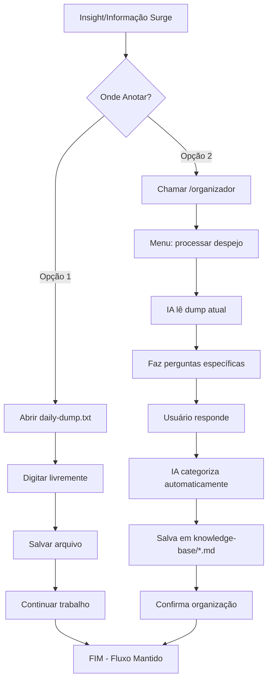

# Assistente Pessoal IA - Especificação de UI/UX

## Introdução

Esta especificação define os objetivos de experiência do usuário, arquitetura da informação, fluxos de usuário e especificações de design conversacional para a interface do **Assistente Pessoal IA**. Serve como fundação para desenvolvimento frontend, garantindo uma experiência coesa e centrada no usuário otimizada para TDAH.

### Objetivos Gerais de UX & Princípios

#### Personas de Usuário-Alvo

**Usuário Primário: Arquiteto de Software com TDAH**
- Processamento rápido de informações mas limitações de memória
- Necessita captura ultra-rápida sem fricção
- Prefere personalidades que confrontem construtivamente
- Trabalha com múltiplos projetos e contextos simultaneamente

#### Objetivos de Usabilidade

- **Velocidade de Captura:** Informações despejadas em <5 segundos sem estrutura obrigatória
- **Eficiência de Consulta:** Agentes respondem contexto relevante em <3 segundos
- **Zero Fricção:** Nenhum preenchimento manual obrigatório em todo o sistema
- **Continuidade Contextual:** Retomar contexto após interrupções em <1 minuto

#### Princípios de Design

1. **Velocidade sobre Perfeição** - Captura rápida é mais importante que organização inicial
2. **Confronto Construtivo** - Agentes questionam para crescimento, não validam automaticamente
3. **Modelo Reativo** - Sistema responde quando chamado, nunca interrompe
4. **Contexto Compartilhado Visualizável** - Knowledge-base em Markdown permite tanto acesso textual quanto visualização estruturada quando necessário
5. **Anti-Procrastinação** - Interface elimina barreiras que causam adiamento

### Log de Mudanças

| Data | Versão | Descrição | Autor |
|------|---------|-----------|-------|
| 2025-01-09 | 1.0 | Criação inicial da especificação UX/UI | Sally (UX Expert) |

## Arquitetura da Informação (IA)

### Mapa do Sistema / Inventário de "Telas"

```mermaid
graph TD
    A[Claude Code Interface] --> B[/organizador]
    A --> C[/secretaria]
    A --> D[/arquiteto]
    A --> E[/psicologo - Fase 2]
    A --> F[/mentor - Fase 2]

    B --> B1[Processar Despejo]
    B --> B2[Organizar por Projeto]
    B --> B3[Revisar Pendências]
    B --> KB[Knowledge-Base]

    C --> C1[Agenda do Dia]
    C --> C2[Status de Projetos]
    C --> C3[Lembretes Pendentes]
    C --> C4[Registro de Reunião]
    C --> KB

    D --> D1[Análise de Projeto]
    D --> D2[Discussão Técnica]
    D --> D3[Contexto de Decisões]
    D --> KB

    E --> E1[Fechar Diário]
    E --> E2[Anti-Stress]
    E --> E3[Resolver Conflito]
    E --> KB

    F --> F1[Plano de Carreira]
    F --> F2[Skill Assessment]
    F --> F3[Networking Strategy]
    F --> KB

    KB --> KB1[decisoes/*.md]
    KB --> KB2[contextos/*.md]
    KB --> KB3[projetos/*.md]
    KB --> KB4[pessoas/*.md]

    G[daily-dump.txt] --> B
    H[central-todos.md] --> C
    I[diarios/*.md] --> C
```

### Estrutura de Navegação

**Navegação Primária:** Slash Commands (`/organizador`, `/secretaria`, `/arquiteto`, `/psicologo`, `/mentor`)
- Cada comando atua como "página principal" do agente
- Menu de funcionalidades específicas apresentado na ativação
- Conversa livre sempre disponível após menu

**Navegação Secundária:** Referências de Arquivos
- Agentes referenciam arquivos específicos: "verifique `knowledge-base/projetos/projeto-alpha.md`"
- Usuário pode abrir arquivos .md diretamente para visualização detalhada
- Estrutura de pastas navegável via explorador de arquivos quando necessário
- **Splitting Automático:** IA decide quebrar conteúdos quando arquivos ficam muito grandes (>2000 linhas)

**Estratégia de Breadcrumb:** Contextual via Agente
- Cada agente mantém contexto da conversa atual
- Referências cruzadas automáticas: "baseado no que discutimos com `/arquiteto` sobre performance..."
- Histórico de comandos recentes disponível

## Fluxos de Usuário

### Fluxo 1: Captura Ultra-Rápida de Informação

**Objetivo do Usuário:** Despejar qualquer informação importante sem perder o fluxo de trabalho

**Pontos de Entrada:**
- Arquivo `daily-dump.txt` aberto diretamente
- Via `/organizador` → "processar despejo"

**Critérios de Sucesso:** Informação capturada em <5 segundos, zero fricção



### Fluxo 2: Consulta de Contexto com Agente Especializado

**Objetivo do Usuário:** Obter consultoria especializada com memória contextual completa

**Pontos de Entrada:** Qualquer um dos 5 agentes especializados

**Critérios de Sucesso:** Resposta contextualizada em <3 segundos, agente demonstra memória histórica

```mermaid
graph TD
    A[Necessidade de Consultoria] --> B{Que Tipo?}
    B -->|Organizacional| C[/organizador]
    B -->|Executiva| D[/secretaria]
    B -->|Técnica| E[/arquiteto]
    B -->|Pessoal| F[/psicologo]
    B -->|Carreira| G[/mentor]
    C --> H[Menu de Opções]
    D --> H
    E --> H
    F --> H
    G --> H
    H --> I[Seleciona Função ou Conversa Livre]
    I --> J[IA acessa knowledge-base]
    J --> K[IA carrega contexto relevante]
    K --> L[Resposta com memória histórica]
    L --> M[Confronto/questionamento construtivo]
    M --> N{Usuário Satisfeito?}
    N -->|Não| O[Aprofunda discussão]
    N -->|Sim| P[IA salva novos insights]
    O --> L
    P --> Q[FIM - Contexto atualizado]
```

### Fluxo 3: Processamento de Reunião com Extração Automática

**Objetivo do Usuário:** Transformar transcrição de reunião em resumo estruturado + todos extraídos

**Pontos de Entrada:** `/secretaria` → "registro de reunião"

**Critérios de Sucesso:** Resumo estruturado + todos extraídos + contexto salvo na knowledge-base

```mermaid
graph TD
    A[Reunião Terminou] --> B[/secretaria]
    B --> C[Menu: registro de reunião]
    C --> D[Colar transcrição completa]
    D --> E[IA processa transcrição]
    E --> F[Gera resumo estruturado]
    F --> G[Extrai todos automáticos]
    G --> H[Identifica projetos/pessoas]
    H --> I[Salva em knowledge-base/contextos/]
    I --> J[Atualiza knowledge-base/projetos/]
    J --> K[Adiciona todos em central-todos.md]
    K --> L[Apresenta resultado para validação]
    L --> M{Usuário Aprova?}
    M -->|Sim| N[Salva definitivamente]
    M -->|Não| O[Permite edição]
    O --> L
    N --> P[FIM - Contexto preservado]
```

## Biblioteca de Componentes / Sistema de Design

### Abordagem do Sistema de Design

**Sistema de Design Conversacional** - Focado em personalidades distintas e padrões de interação, não elementos visuais tradicionais. Cada agente possui "componentes" de personalidade reutilizáveis e consistentes.

### Componentes Centrais

#### Componente: Menu de Agente

**Propósito:** Apresentação inicial padronizada quando agente é chamado

**Variantes:**
- Menu Organizador (eficiente, processual)
- Menu Secretária (executiva, proativa)
- Menu Arquiteto (técnico, confrontador)
- Menu Psicólogo (empático, questionador)
- Menu Mentor (estratégico, desafiador)

#### Componente: Confronto Construtivo

**Propósito:** Questionamento que desafia construtivamente sem ser destrutivo

**Variantes por Agente:**
- Confronto Organizacional: "Essa categoria faz sentido?"
- Confronto Executivo: "Isso realmente é prioridade hoje?"
- Confronto Técnico: "Por que não considerou X?"
- Confronto Pessoal: "O que você está evitando enfrentar?"
- Confronto Estratégico: "Como isso te aproxima dos seus objetivos de longo prazo?"

#### Componente: Referência Cruzada

**Propósito:** Conectar informações entre agentes e contextos

**Padrões:**
- Referência a arquivo específico: "como discutimos em `projetos/projeto-x.md`"
- Referência a agente: "baseado na conversa com `/arquiteto` sobre..."
- Referência temporal: "na reunião de quinta-feira passada..."

## Branding & Guia de Estilo

### Personalidades Completas dos Agentes

| Agente | Personalidade | Tom | Linguagem | Fase | Exemplo de Fala |
|--------|---------------|-----|-----------|------|-----------------|
| `/organizador` | Processador Eficiente | Direto, metódico | Clara, estruturada | MVP | "Identifiquei 3 tópicos no seu despejo. Vamos por partes?" |
| `/secretaria` | Gestora Executiva | Proativa, organizada | Profissional, cuidadosa | MVP | "Você tem reunião em 30min. Status do projeto Alpha precisa ser atualizado primeiro." |
| `/arquiteto` | Consultor Técnico | Confrontador, direto | Técnica, questionadora | MVP | "Microserviços aqui? Com essa latência? Explique sua lógica." |
| `/psicologo` | Terapeuta Confrontador | Empático mas desafiador | Psicológica, instigante | Fase 2 | "Se resolveu com sua irmã? Acho importante você fazer isso. Quer que eu escreva a mensagem?" |
| `/mentor` | Coach Sênior "Bill Gates" | Estratégico, desafiador | Desenvolvimento, visionário | Fase 2 | "Comunicação é sua próxima barreira de crescimento. Que livros leu sobre liderança técnica?" |

### Funcionalidades Completas por Agente

#### `/organizador` (MVP)
- *processar despejo* - Analisa daily-dump.txt e categoriza via perguntas
- *organizar por projeto* - Reorganiza informações por contexto de projeto
- *revisar pendências* - Identifica ações não categorizadas
- *categorizar informações* - Processamento manual de inputs específicos

#### `/secretaria` (MVP)
- *agenda do dia* - Visão executiva dos compromissos
- *status de projetos* - Dashboard de todos os projetos ativos
- *lembretes pendentes* - Lista de ações que precisam atenção
- *cadastrar compromisso* - Adiciona novos itens à agenda
- *registro de reunião* - Transcrição → resumo + todos extraídos
- *what's next?* - Sugestões de próximas ações baseadas em contexto

#### `/arquiteto` (MVP)
- *análise de projeto* - Review técnico de URLs/repositórios
- *review de código* - Análise de qualidade e padrões
- *discussão técnica* - Consultoria sobre decisões arquiteturais
- *padrões e boas práticas* - Orientação sobre standards
- *performance analysis* - Avaliação de otimizações
- *contexto de decisões* - Recuperação de rationale histórico

#### `/psicologo` (Fase 2)
- *fechar diário* - Processamento do dia com reflexão
- *sessão de casal* - Suporte para questões relacionais
- *anti-stress* - Técnicas de manejo de ansiedade
- *resolver conflito* - Mediação de situações interpessoais
- *check-in semanal* - Revisão de bem-estar e crescimento
- *desenvolvimento pessoal* - Trabalho de autoconhecimento

#### `/mentor` (Fase 2)
- *plano de carreira* - Estratégia de crescimento profissional
- *skill assessment* - Avaliação de competências técnicas/soft
- *livros recomendados* - Curadoria de leituras para desenvolvimento
- *networking strategy* - Orientação para construção de rede
- *feedback 360* - Análise de percepção profissional
- *visão estratégica* - Planejamento de longo prazo

### Iconografia Expandida

**Biblioteca Completa de "Ícones":**
- **Organizador:** 📚 (processamento), 🗂️ (categorização), 🔍 (análise)
- **Secretária:** 📋 (agenda), 🤝 (reuniões), ⏰ (lembretes), 📈 (projetos)
- **Arquiteto:** 🏗️ (construção), ⚡ (performance), 🎯 (decisões), 🔧 (review)
- **Psicólogo:** 🧠 (mente), 💭 (reflexão), 🤔 (questionamento), 💚 (crescimento)
- **Mentor:** 🎖️ (senioridade), 🚀 (carreira), 📚 (aprendizado), 🔮 (visão)

### Tipografia Conversacional

**Família de "Fontes" (Estilos de Texto):**
- **Primária:** Comunicação direta e clara (tom natural dos agentes)
- **Secundária:** Referências técnicas (nomes de arquivos, comandos)
- **Monospace:** Código e estruturas (quando mencionados)

**Escala de "Tipos" (Hierarquia de Importância):**
- **H1:** Respostas principais dos agentes
- **H2:** Subtópicos e esclarecimentos
- **H3:** Detalhes e referências
- **Body:** Conversação normal
- **Small:** Metadados e contexto adicional

## Requisitos de Acessibilidade

### Meta de Conformidade

**Padrão:** WCAG 2.1 Nível AA aplicado ao contexto conversacional

### Requisitos Principais

**Visual:**
- Contraste de cores: N/A (texto puro via Claude Code)
- Indicadores de foco: Gerenciados pelo Claude Code
- Dimensionamento de texto: Configurável pelo usuário no Claude Code

**Interação:**
- Navegação por teclado: 100% via teclado (slash commands e texto)
- Suporte a leitores de tela: Arquivos .md são naturalmente compatíveis
- Alvos de toque: N/A (sistema desktop via teclado)

**Conteúdo:**
- Texto alternativo: Emojis usados com moderação, sempre com contexto textual
- Estrutura de cabeçalhos: Arquivos .md seguem hierarquia semântica correta
- Rótulos de formulário: N/A (interação conversacional, não formulários)

**Considerações Especiais para TDAH:**
- **Linguagem clara:** Agentes usam linguagem direta, evitam jargão desnecessário
- **Estrutura consistente:** Menus de agentes seguem padrões previsíveis
- **Sobrecarga cognitiva reduzida:** Uma tarefa por vez, sem múltiplas opções simultâneas
- **Feedback imediato:** Confirmações claras para todas as ações importantes

## Estratégia de Responsividade

### Breakpoints

| Breakpoint | Largura Mín | Largura Máx | Dispositivos Alvo | Considerações |
|------------|-------------|-------------|-------------------|---------------|
| Desktop | 1024px | - | Desktop, Laptop | Claude Code nativo |
| Tablet | 768px | 1023px | Tablet landscape | Via browser se necessário |
| Mobile | 320px | 767px | Smartphones | Não prioritário para MVP |

### Padrões de Adaptação

**Adaptações de Layout:**
- **Desktop:** Interface completa do Claude Code com todos os recursos
- **Tablet:** Funcionalidade básica via browser (se Claude Code não disponível)
- **Mobile:** Visualização de arquivos .md apenas, interação limitada

**Mudanças de Navegação:**
- **Desktop:** Slash commands completos + navegação de arquivos
- **Tablet:** Comandos simplificados, visualização de .md otimizada
- **Mobile:** Somente leitura de knowledge-base, sem interação com agentes

**Priorização de Conteúdo:**
- **Crítico:** Captura de informações (daily-dump.txt)
- **Importante:** Consulta a agentes especializados
- **Secundário:** Navegação visual da knowledge-base
- **Opcional:** Funcionalidades avançadas dos agentes Fase 2

## Considerações de Performance

### Objetivos de Performance

- **Resposta de Agente:** <3 segundos para qualquer comando slash
- **Busca na Knowledge-base:** <1 segundo para qualquer consulta
- **Processamento de Despejo:** <30 segundos para daily-dump completo
- **Carregamento de Contexto:** <1 segundo para recuperar histórico de agente

### Estratégias de Design que Impactam Performance

**Otimizações Conversacionais:**
- Respostas dos agentes são estruturadas para comunicação eficiente
- Referências cruzadas são lazy-loaded (só carregadas quando mencionadas)
- Contexto histórico é limitado a informações relevantes para a conversa atual

**Otimizações de Arquivos:**
- Arquivos .md mantidos em tamanhos gerenciáveis (splitting automático IA)
- Estrutura de pastas otimizada para acesso direto por categoria
- Metadados mínimos nos arquivos para rapidez de parsing

**Gestão de Memória:**
- Agentes carregam apenas contexto necessário para sessão atual
- Knowledge-base é acessada incrementalmente, não carregada toda
- Daily-dump é processado em chunks, não como arquivo único grande

## Próximos Passos

### Ações Imediatas

1. **Revisar especificação com stakeholders** (usuário TDAH + desenvolvedor)
2. **Criar protótipo conversacional** de um agente (recomendo `/organizador`)
3. **Definir estrutura de arquivos .md** detalhada para knowledge-base
4. **Estabelecer padrões de prompts** para cada personalidade de agente
5. **Configurar ambiente de desenvolvimento** Claude Code + estrutura de pastas

### Checklist de Handoff para Design

- [x] Todos os fluxos de usuário documentados
- [x] Inventário completo de "componentes" conversacionais
- [x] Requisitos de acessibilidade definidos
- [x] Estratégia responsiva clara
- [x] Diretrizes de marca/personalidade incorporadas
- [x] Objetivos de performance estabelecidos

---

*Especificação criada por Sally (UX Expert) usando metodologia BMAD™*